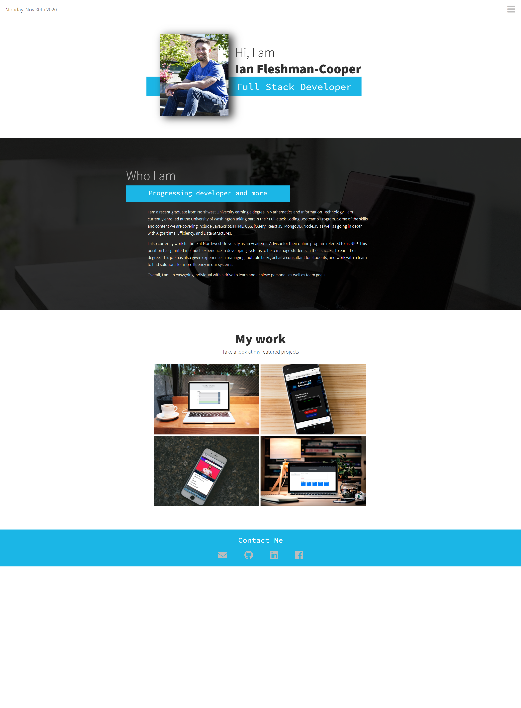
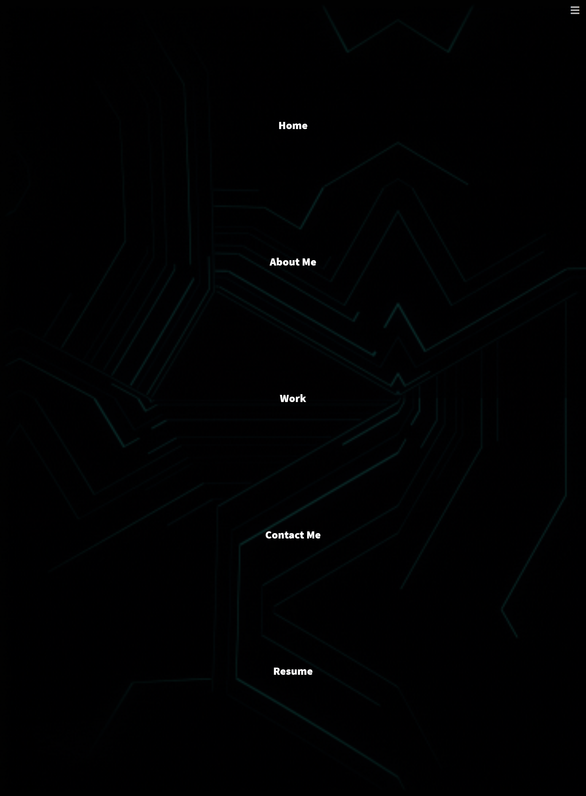
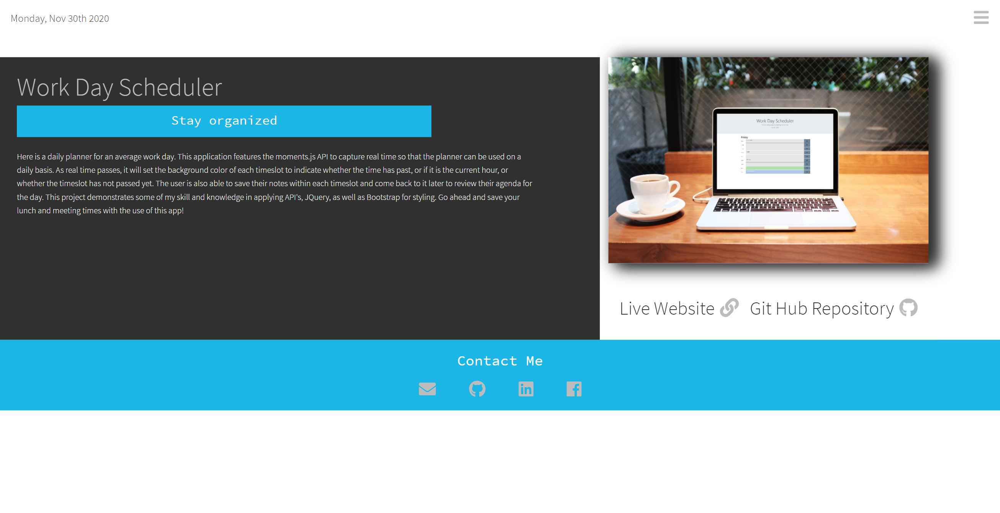

# Portfolio_3
# Description
This an updated version of my previous portfolio 2.0. This portfolio is very similar in layout and function but is now built with React.Js versus the basic, HTML, CSS, and JS version. During this conversion, I had to break down each HTML section into separate components and then strategically sync the appropriate styling elements and JS functions with its corresponding component. In this update, I have learned that that are a variety of different ways to go about similar results when working with react. For instance, instead of working with moments.js for the current date, I instead worked with a npm package called react-moments. I have also updated much of my works sections by adding more projects, while also updating the about me section and my resume. 

## Table of Contents

* [License](#license)
* [Contributing](#contributing)
* [Screenshots](#screenshots)
* [Link](#link)
* [Questions](#questions)

## License

MIT

## Contributing

Ianaac27

# Screenshots
Here are mocks of Portfolio 3.0.

Home Page

Navigation Menu

Project Page

# Link
Take a look at the live version [here] deployed through Heroku.(https://portfolio-react-ifc.herokuapp.com/)

## Questions

If you have any questions, please refer to my contact information below.

[GitHub: Ianaac27](https://www.github.com/Ianaac27)

Email: ian.fleshmancooper@gmail.com

